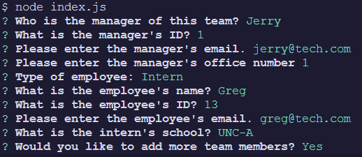

# Employee Information Page

## Description

A CLI application that generates an HTML view of all employees

## Table of Contents

- [Installation](#installation)
- [Usage](#usage)
- [Credits](#credits)
- [Screenshots](#screenshots)
- [Demo](#demo)
- [License](#license)

## Installation

Clone the repository, run `npm install`, then run `node index.js`

## Usage

Enter the manager's information first, then enter employee information for either Engineers or Interns. When you're satisfied with the number of employees you've entered, an html file will be generated in the dist folder.

## Screenshot

## Demo

https://watch.screencastify.com/v/FVidlqpGnlbsQZQFhz8S

## License

This project is covered under the MIT license.

## Contact Me

 [TemplarManatee](https://github.com/TemplarManatee/)

You can reach me at dylanbfreeman@gmail.com with any questions!
